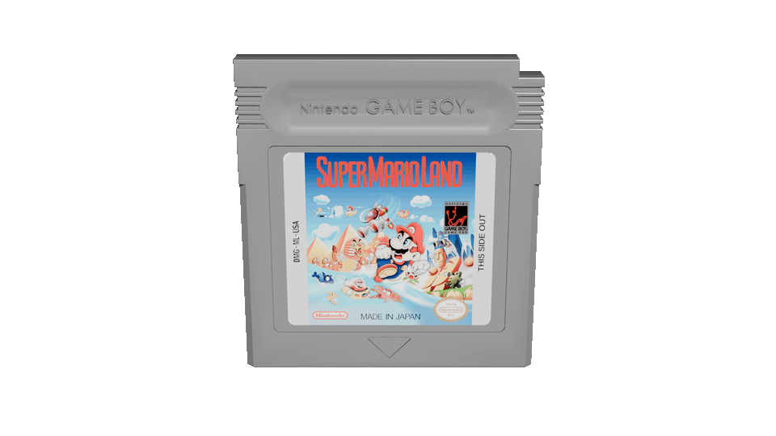
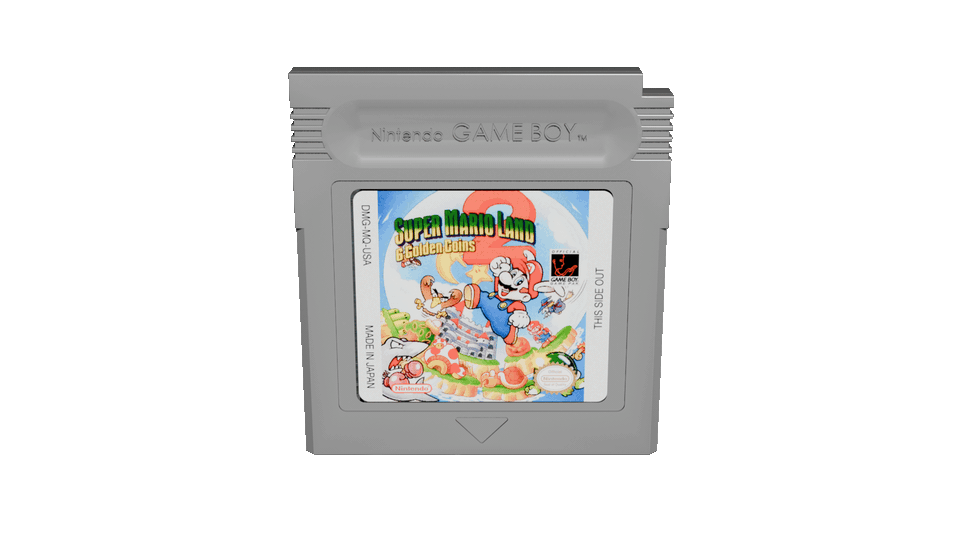
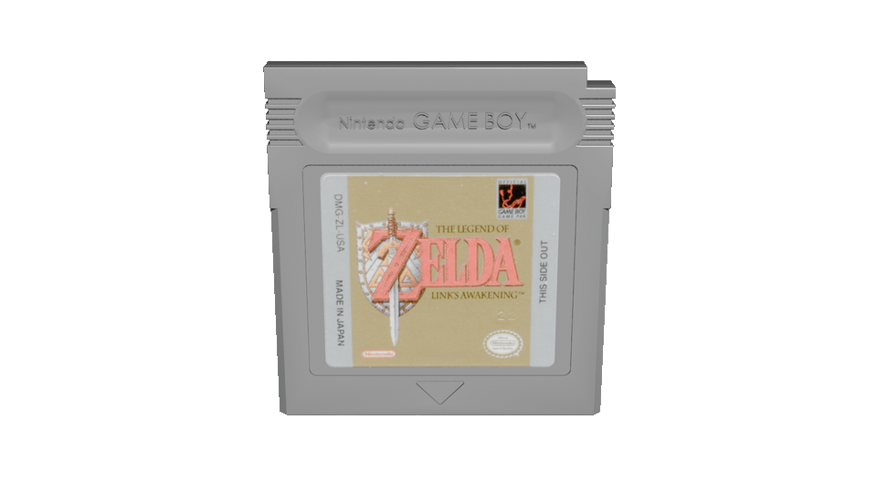
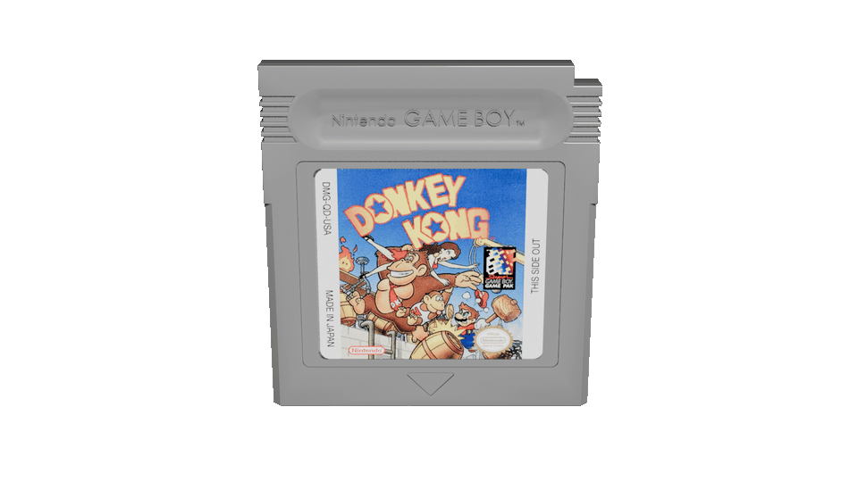
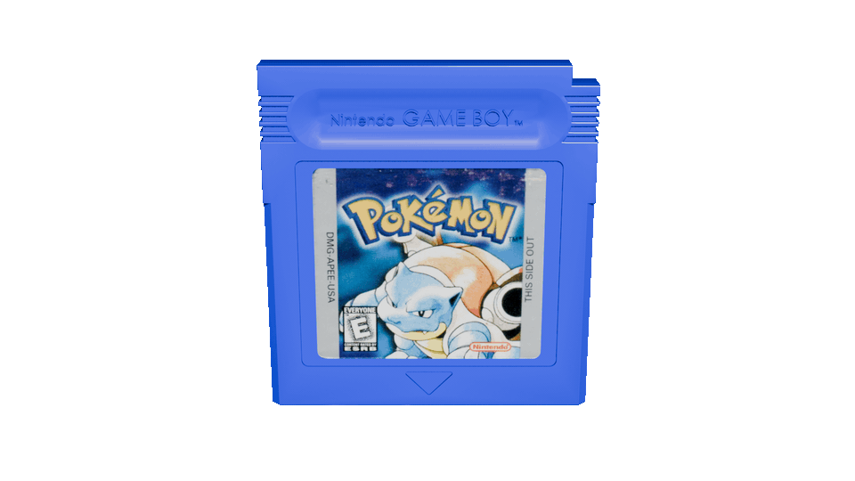
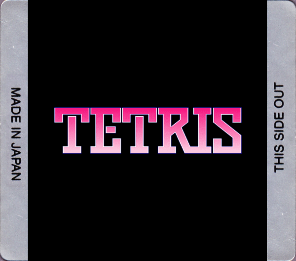

# Cartridge Renders

These are designed for dual-screen handheld frontends (like [Cocoon](https://github.com/inssekt/CocoonFE), or [ES-DE](https://es-de.org) with [ES-DE Companion](https://github.com/RobZombie9043/es-de-companion) to show as a second screen preview. They can be used with any frontend on any system that would support animated gifs as preview media.

### Project Information

The intent of the project is to complete as many systems as it's possible to do with a reasonable degree of accuracy.

I may not get all games for a system, they will generally be based on a 1G1R set, possibly with some hacks or translations. If the filename does not match your ROM set, rename them to match.

The source files for [Blender](https://www.blender.org) are provided. The Python script is embedded in the Blender project.

Due to file size restrictions on GitHub, the pre-rendered animations are hosted on [The Internet Archive](https://archive.org/details/media-animations-for-frontends)

The models will be designed around the label images from [Screenscraper](https://screenscraper.fr) whenever possible. There will be a template and macro for [Affinity](https://www.affinity.studio) to generate generic labels from logos to fill in any gaps.

If the game shipped on a special colored cartridge, that will be replicated in the script. The script can be changed to use a different default color, change the special cartridge colors, and add or remove games. It selects based on finding text in the image's filename. For example, if you add "Kirby" as an item, it would color every cartridge where "Kirby" is in the filename. Most scrapers use the filename or game's title for the image filenames.

Alternate cartridge types (ie. Game Boy Color rumble carts and backwards compatible black carts) will be supported as much as possible, but one-offs like the microphone cartridge used on one Game Boy Tamagotchi game may not be modeled and use a generic cartridge. Pull Requests will be accepted to add them.

I will attempt to keep the [Project](https://github.com/users/TVsIan/projects/4) updated with the system I am currently working on plus the next one, please feel free to create other systems based on the source file and submit pull requests. I can do the rendering if needed.

### How To

To use the images, just drop them in to replace an existing media item in the frontend. Cocoon has a field for preview images. If using ES-DE Companion, pick an image that isn't used in your ES-DE theme, but can be set to use on the Companion display. Cartridge is generally safe.

To create the generic images, add the macro to Affinity's library and select it when running a batch job. Use logo images (or anything sized similarly) as the source. Changing the base template, to change the background color for example, will require editing the macro. Since the template has a black background, logos that are all or mostly black may need to be edited beforehand to add a border or change the color. An extra step could be manually added to the macro, but it would do that for all images.

To render your own, run the script from a command prompt:

```
blender --background "/path/to/Game Boy Cartridge.blend" --python-text creategifs.py -- --l /path/to/labels
```

Make sure to include the empty -- between the script and the script options, this allows Blender to pass options to the script.

**Options:**

* `-l, --labelpath`: The folder containing the label images. It will scan recursively. This is the only required option.
* `-g, --gifpath`: The folder to output to. By default, it will create an /animations folder under the label path.
* `-b, --binary`: The path to an FFmpeg executable. Defaults to C:\ffmpeg\bin\ffmpeg.exe.
* `-a, --animation`: Which animation to render. It can be a single animation or a comma-separated list. It defaults to all four. If more than one is specified, it will automatically create subfolders in the output folder.
* `-s, --size`: The size to scale the final gifs to. Enter as Width:Height, ie 1920:1080. It renders at 1920x1080, and by default scales to 960x540.
* `-f, --fps`: The FPS of the final gif. The default is 12 FPS, it will run slower at a lower FPS or faster at a higher FPS, the render is fixed to 12 FPS.
* `-o, --overwrite`: If set, will overwrite existing gifs. Otherwise, it will skip rendering anything that already exists in the destination folder.

### Image Information

The renders are 960x540 at 12FPS, to try and balance file size and quality. The source file and script can be modified if you prefer larger or smaller images.

There are currently four animations. See each section for examples.

* **Spin**: The cartridge spins, somewhat slower when the label is visible.
* **Float**: The cartridge stays in place, tilting back and forth.
* **Bob**: Similar to Float, but the cartridge bobs up and down.
* **Wobble**: The cartridge twists back and forth and leans, similar to the VMU animation in the Dreamcast BIOS.

### Completed Systems:

#### Game Boy

**Spin**

**Float**

**Bob**

**Wobble**

**Color Cartridge**

**Generic Label**

